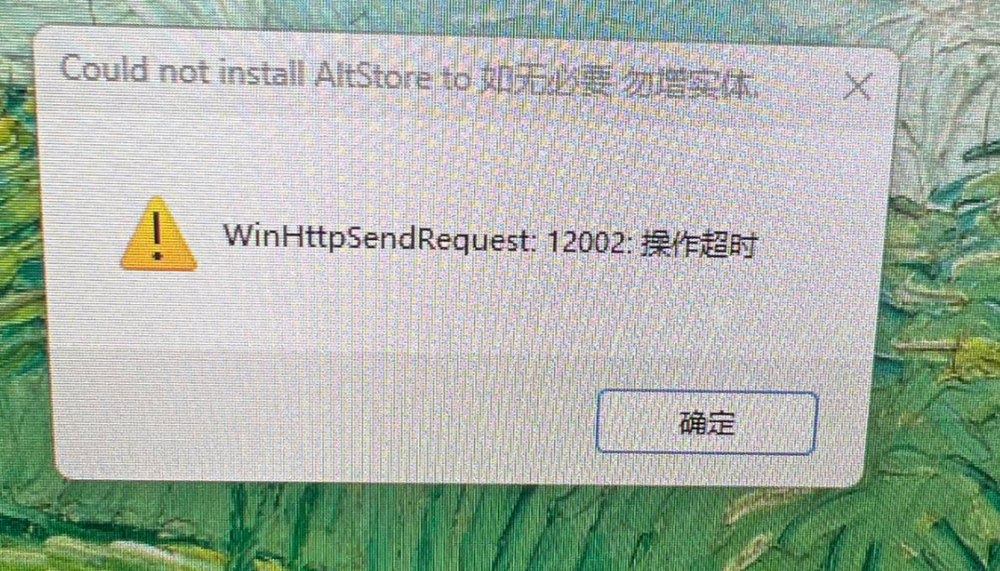

# Sideload Apps

本仓库收录 在非越狱 iOS 设备上安装 IPA 应用的入门指南与资源合集，适合新手快速上手。
支持通过 AltStore、SideStore 等方式进行侧载，常见用途包括：微信双开、淘宝双开 等。

## **Repo 导航**

**IPA 安装**

- [AltStore 快速开始](./AltStore-Get-Started.md)
- [SideStore 快速开始](./SideStore-Get-Started.md)

**IPA 下载**

- [自用 IPA 列表（iOS 版本 18.4）](https://github.com/ycj3/Sideload-Apps/releases/tag/ipa-list)

相关**越狱文档**，请跳转至 [这里](./READNE_JB.md)

## 常见问题

### **Q1：SideStore 相比 AltStore 最大的优势是什么？**

**A：SideStore 只在首次安装时需要 AltServer，之后应用刷新都可以在手机本地自动完成，无需每周连接电脑。**

### **Q2：（Window）AltStore 无法安装，报错：WinHttpSendRequest: 12002 操作超时**

请确认已经尝试过一下操作：

- 右键点击 AltServer，选择 “以管理员身份运行”
- 确保在使用 AltServer 时，iTunes 和/或 iCloud 正在运行
- 尝试使用 另一个 Apple ID。如有需要，你可以专门为 AltStore 免费创建一个新的 Apple ID 来使用。
- 你是否是通过 Microsoft Store 安装的 iTunes 或 iCloud？
  如果是，请将它们卸载，并直接从 Apple 官方网站 下载并安装最新版本。
- 重新授权 iTunes: 打开 iTunes，通过菜单栏 账户 > 授权 > 授权此电脑

---

## 赞赏项目

如果觉得这个项目对你有帮助，欢迎请我喝咖啡 ☕️

> 采取**自愿**原则, 收到的赞赏将用于更好的项目建设。

<table align="left">
  <tr>
    <td align="center">
      
      
微信

    </td>
    <td align="center">
      
      
支付宝

    </td>
  </tr>
</table>
